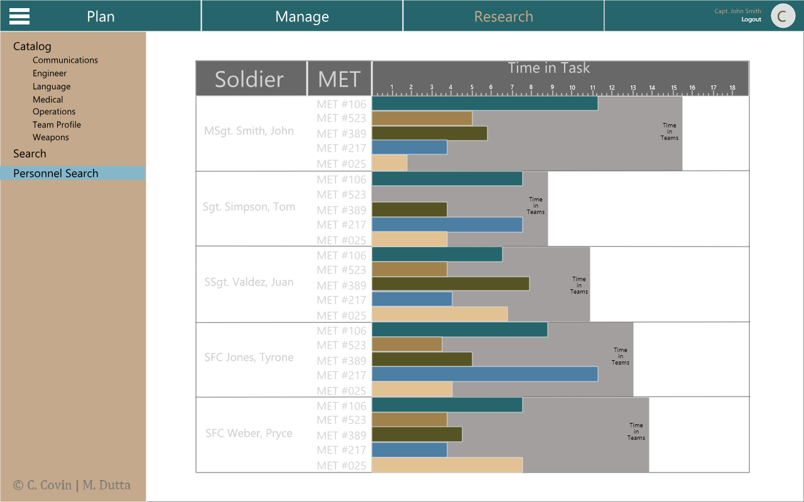
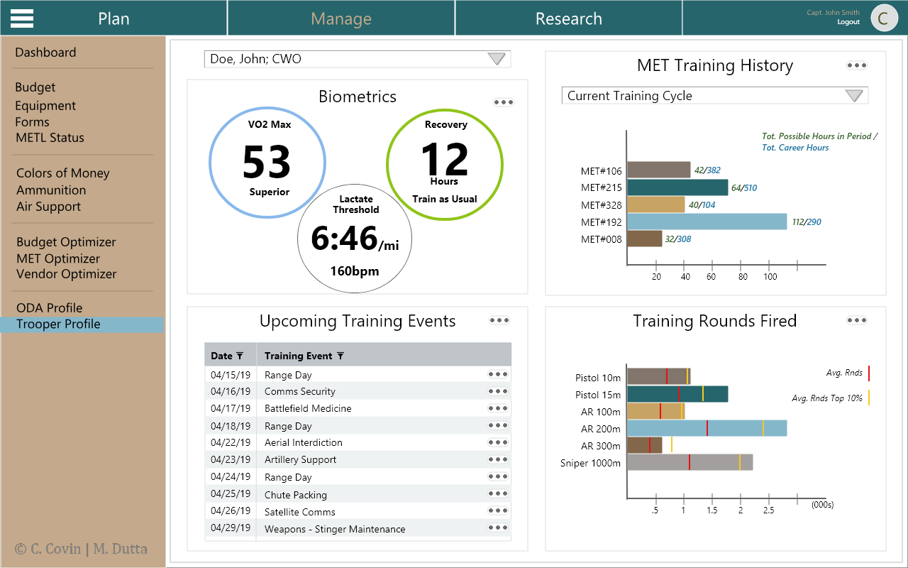
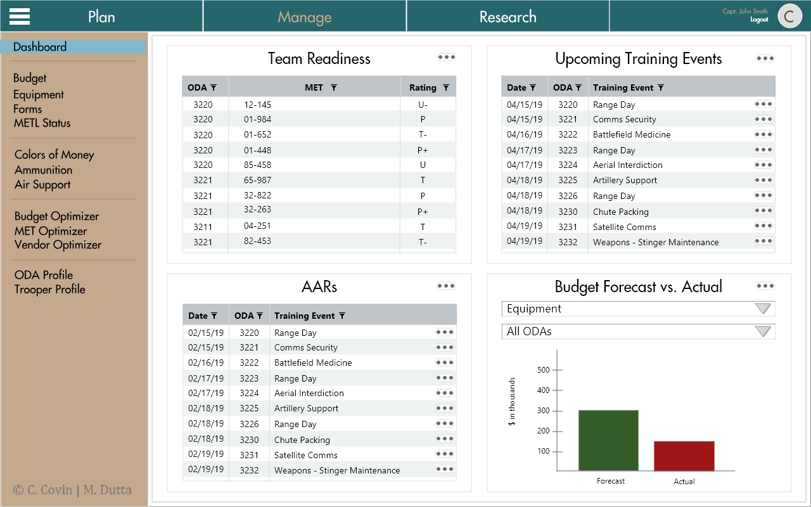
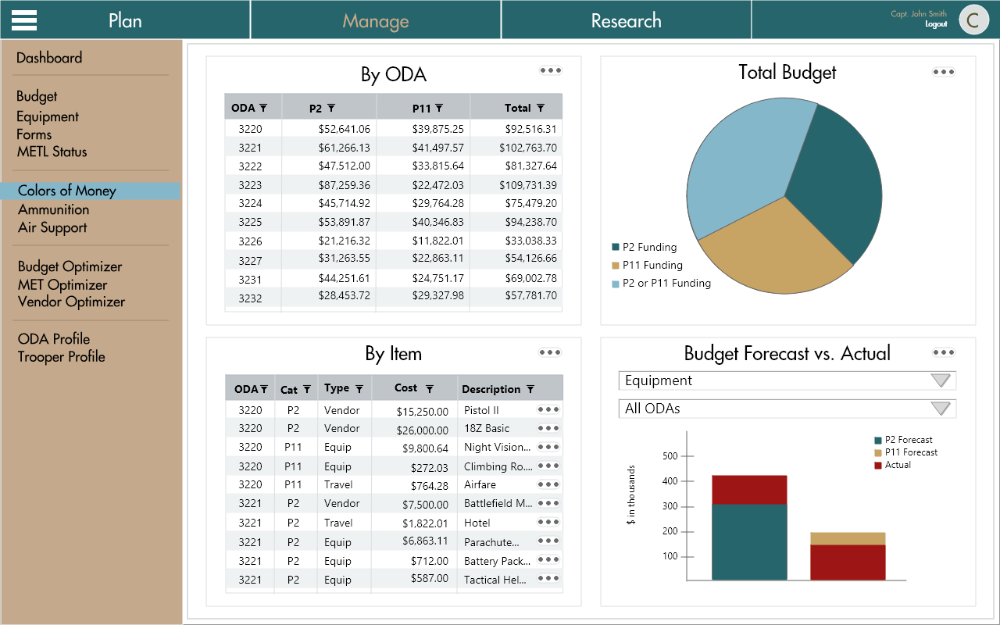
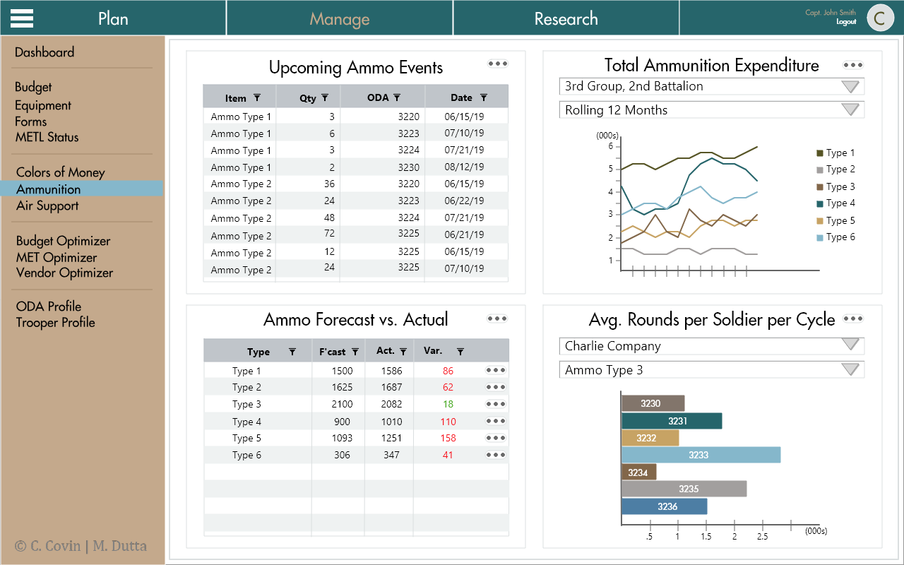

# US-Special-Forces-Training

BACKGROUND:
This application design was rooted in a Hacking 4 Defense project run out of Duke University. It was a fantastic experience! Our sponsor was the Special Forces 3rd Group based at Ft. Bragg in Fayetteville, NC. We were asked to devise solutions to address the regular budget overruns encountered by Special Forces teams during their training cycles. These overruns have become a major problem and challenge to readiness since the Sequestration rules of the U.S. Federal Budget were activated.  

METHODOLOGY:
Over the course of 130+ research interviews with SF personnel we employed Lean Startup and Design Thinking techniques to design a system to Capture, Synthesize, and Enhance each training cycle. 

RESULT:
Initial tests indicated increased budgetary accuracy of at least 50% Year 1 with compounding improvements going forward. Additionally, the sytem opened the door to unprecendented analytical and force management capabilities. 

Our Special Forces sponsors were ecstatic and we were poised to formally incorporate a new company to deliver the first version for field trials. Ironically, our military sponsors could not secure funding to move forward due to the budget sequestration. 

WHAT IS IN THIS REPOSITORY:
Below are a handful of the 60+ designs from our high-fidelity prototype. We are not making the full set and interactive prototype publicly available.

